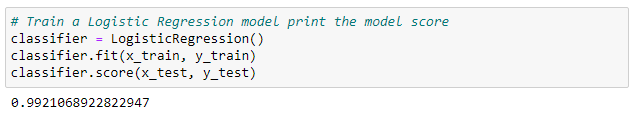

# supervised-machine-learning-challenge
## GA Tech Data Science and Analytics Boot Camp Module 19
### Description

In this module, we utilize machine learning models with Python library sklearn. More specifically, we will use LogisticRegression and RandomForestClassifier.

With the provided <a href="Resources/lending_data.csv">lending_data</a> dataset, we split the data into x_train, X_test, y_train, and y_test before running it through each of the training models.

Prior to completing the training models, the prediction that I provided in the Jupyter notebook was: I think the Logistic Regression model will perform better. Because we will be using loan_status as the Y variable, this binary variable will allow the data to be categorized into two clusters. While Random Forest model can do just as well, it is better suited for datasets with more categories of data.

Once the dataset was processed by each model, we see the following results:

In conclusion, the Logistic Regression model performed better, making my prediction correct. Given that we are predicting a discrete set of classes (True = 1/False = 0) with the loan_status variable, the classification algorithm of Logistic Regression performs better

## Submission Requirements:
* <a href="'Credit Risk Evaluator'.ipynb">Jupyter notebook
* Prediction and analysis